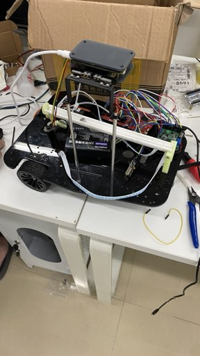

# 2026 电赛 H 题 · 车载平衡滚球运动控制系统

[]()
[]()
[]()



## 🎬 视频演示

[点击观看项目演示视频](https://www.bilibili.com/video/BV1GYas6zEE8/?p=2&share_source=copy_web&vd_source=3e91621c13c255ed93fd0535a923782b)

## 👤 作者
- **ZhengYong Chen**

## 📖 项目简介

本项目为 **2026 年全国大学生电子设计竞赛 H 题** 的完整代码实现。系统以 **TI MSPM0G3507** 为主控，配合 **亚博 K230** 作为上位机视觉处理单元，驱动一辆载有平衡滚球装置的循线小车。

小车通过 **8 路灰度传感器** 实现基础巡线，同时利用 **DBS300 舵机** 驱动摆杆机构，使钢珠动态稳定在摆杆中点。主控通过串口以 **50Hz** 频率接收上位机下发的四字节位置信息（帧头 `0xAA`），解析出钢球相对中点的偏移量 `ΔPosition` 和每帧移动速度 `ΔSpeed`，采用 **同步双串 PID（位置环 + 速度环）** 进行闭环控制。

实测表明：无论载具发生横向或纵向运动，钢球位置偏移均不超过 **±2cm**。

## ✨ 功能特性

- **视觉定位**：K230 运行 YOLO 目标检测，识别钢珠位置并通过串口下发坐标与速度。
- **循线行驶**：8 路灰度传感器实现稳定巡线，支持直道、弯道等典型赛道。
- **平衡控制**：舵机直驱摆杆，基于双环 PID 实现钢珠动态平衡。
- **实时通信**：自定义四字节串口协议（帧头 `0xAA` + 位置 + 速度），50Hz 刷新率。
- **状态显示**：OLED 实时显示传感器状态与 PID 输出。
- **按键交互**：按键状态机实现模式切换与参数调整。

## 🛠️ 硬件选型

| 模块 | 型号 | 说明 |
| :--- | :--- | :--- |
| **主控** | TI MSPM0G3507 官方评估板 |
| **上位机** | 亚博 K230 | RISC-V 双核 + KPU，运行 YOLO |
| **电机驱动** | TB6612 双路有刷驱动模块 | 驱动直流减速电机 |
| **传感器** | 8 路灰度传感器 | 巡线检测 |
| **执行器** | DBS300 舵机 | 驱动摆杆机构 |
| **显示** | OLED | 硬件 I2C 驱动 |

## 🧠 控制算法

- **巡线控制**：灰度传感器加权求偏差，通过位置式 PID 输出差速控制量。
- **平衡控制**：同步双串 PID
  - **外环（位置环）**：钢球偏移量 → 期望速度
  - **内环（速度环）**：期望速度与实测速度偏差 → 舵机 PWM
- **通信协议**：`[0xAA][ΔPosition_H][ΔPosition_L][ΔSpeed_H][ΔSpeed_L]`，50Hz 更新。

## 📁 目录结构

```text
project/
├── Control/        # 电机、舵机控制代码
├── Encoder/        # 编码器正交解码
├── GYRO/           # 废弃（保留占位）
├── Key/            # 按键状态机
├── MPU6050/        # 陀螺仪驱动
├── OLED/           # OLED 硬件 I2C 驱动
├── Sensor/         # 八路灰度传感器
├── sys/            # 延时、调试等系统代码
└── README.md
